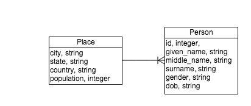

## Rails: `has_many` \& `belongs_to`


So far you've seen how to associate records with on another using foreign keys in a database. Just as we can use ActiveRecord to read, change, update, and delete data from our database, we can use ActiveRecord relationship methods to associate ActiveRecord models with one another using Ruby code.

Objectives
----------

* Diagram the database tables and Entity Relationship Diagram that describe a parent-child relationship.
* Write a migration for a parent-child relationship.
* Configure ActiveRecord to manage parent-child relationships using `has_many` and `belongs_to`.
* Create associated records using the rails console.
* Associate plain Ruby objects with one another.
* Compare `has_many` and `belongs_to` to other macros, like `attr_accessor`.


Instructions
------------

Fork and clone this repo. Change into the appropriate directory and update dependencies.

Next, create your database, migrate, and seed. Start your web server.

*You may have to drop the DB if you already have a DB named `rails_has_many_development`.*.

```bash
rake db:create
rake db:migrate
```


## Data Modelling

Data Modelling is a field in and of itself. We'll not dive into the this very deep. A common way to create data models is to use [Crows Foot Notation](http://www.codeproject.com/Articles/878359/Data-modelling-using-ERD-with-Crow-Foot-Notation) to create a Entity Relationship Diagram(ERD).

We'll use a subset of Crows Foot Notation to diagram relationships between Models/Entities.




One Place has many People. There is a a one to many relationship between Place and People.

## Implementing the Data Model

Lets use [Rails Migrations](http://guides.rubyonrails.org/active_record_migrations.html) to generate database schema using SQL Data Definition statements ([DDL](http://www.tomjewett.com/dbdesign/dbdesign.php?page=ddldml.php)).

`rails generate migration ... ==> migrations ==> DDL`

For help with Rails Migrations see:  

*  [Active Record Migrations](http://guides.rubyonrails.org/active_record_migrations.html), search for `rails generate`.
* $ rails generate migration
* [Migration Native Types](http://api.rubyonrails.org/classes/ActiveRecord/ConnectionAdapters/TableDefinition.html#method-i-column)
* [Rails Schema Statements](http://api.rubyonrails.org/classes/ActiveRecord/ConnectionAdapters/SchemaStatements.html)


#### Create the Person and Place models.

> First, we'll create Person model. 
 
```bash
$ rails g migration CreatePerson given_name:string middle_name:string last_name:string gender:string  dob:string
```

> Then we'll create a Place model

```bash
$ rails g migration CreatePlace city state country population:integer
```

> Run the migration to create the schema using the DDL generated by the above migrations.

```bash
$ rails db:migrate
```

> Let's take a look at the current data model in `db/schema.rb`

```ruby
ActiveRecord::Schema.define(version: 20151031064422) do

  # These are extensions that must be enabled in order to support this database
  enable_extension "plpgsql"

  create_table "people", force: :cascade do |t|
    t.string "given_name"
    t.string "middle_name"
    t.string "last_name"
    t.string "gender"
    t.string "dob"
  end

  create_table "places", force: :cascade do |t|
    t.string  "city"
    t.string  "state"
    t.string  "country"
    t.integer "population"
  end

end
```

> Here we see that we have two models, **People** and **Places**.

> We can see how the schema defines the tables and columns for each model. **And we notice that there are NO relationships between the people and places models**. We should fix that!

> But, first lets create ActiveRecord models for Person and Place.

> Create `app/models/person.rb`.

```ruby
class Person < ActiveRecord::Base
end
```

> Create `app/models/place.rb`.

```ruby
class Place < ActiveRecord::Base
end
```

> Lets check these models with the rails console.

```bash
$ rails console
> Person.all   # just to init DB connection
> 
> Person
=> Person(id: integer, given_name: string, middle_name: string, last_name: string, gender: string, dob: string)
> 
>
> Place
=> Place(id: integer, city: string, state: string, country: string, population: integer)
```

## You Do

Check the Database using `$ rails db`. Make sure that you understand each table, it's columns and the columns datatypes.

* What commands are you using to check the schema?

* Create a couple of rows for each table using `$ rails console` and check that the database has been updated using `$ rails db`.

* Diagram the physical model, that is each table in the DB and their columns. *Keep this around, we'll be updating it as we continue.*


## Active Record Associations


As the above data model indicates there is a relationship/association between the Person and Place models. The Place model **has many** people and a person **belongs to** a place. 

These **has many** and **belongs to** relationships/associations are implemented in the database by using **foreign keys**. And they are implemented in ActiveRecord Models by using **belongs_to** association and the **has_many** association. [See Active Record Associations](http://guides.rubyonrails.org/association_basics.html)

### Terminology

In the above relationship we often say that there is a **parent-child** relationship. In this case **Place is the parent and Person is the child.**

Also, we'll say that Place has a **collection** of people. And that there is a **one to many** association between these two entities. **One Place will have many People**.
### Implement the Person to Place Association 


#### Create the foreign key in the People table.

> Lets add a foreign key to the people table to create this relationship in the database.

```bash
$ rails g migration AddPlaceRefToPeople place:references
```

> This will generate a migration to create a foreign key in the people table to reference the places table.

```ruby
class AddPlaceRefToPeople < ActiveRecord::Migration
  def change
    add_reference :people, :place, index: true, foreign_key: true
  end
end
```

> Apply the migration.

```bash
$ rails migrate
```

> Check the db with `$ rails db`. We should now see a place_id column that is foreign key from the people table to the places table.

```text
\d people                                               
                                 Table "public.people"                                                      
   Column    |       Type        |                      Modifiers                                           
-------------+-------------------+-----------------------------------------------------                     
 id          | integer           | not null default nextval('people_id_seq'::regclass)                      
 given_name  | character varying |                                                                          
 middle_name | character varying |                                                                          
 last_name   | character varying |                                                                          
 gender      | character varying |                                                                          
 dob         | character varying |                                                                          
 place_id    | integer           |                                                                          
Indexes:                                                                                                    
    "people_pkey" PRIMARY KEY, btree (id)                                                                   
    "index_people_on_place_id" btree (place_id)                                                             
Foreign-key constraints:                                                                                    
    "fk_rails_6f429ca703" FOREIGN KEY (place_id) REFERENCES places(id)
```

> Notice the foreign-key constraint:  `"fk_rails_6f429ca703" FOREIGN KEY (place_id) REFERENCES places(id)`
> 

#### Create the Associations in the AR Models.

> In the Person model add the **belongs to** association.

```ruby
class Person < ActiveRecord::Base
  belongs_to :place
end
```

> In the Place model add the **has many** association.

```ruby
class Place < ActiveRecord::Base
  has_many :people
end
```

#### Create Associations between People and Places.

> Open up the rails console and create a Place.

```ruby
> Place.create(city: 'Boston', state: 'Ma', country: 'US', population: 646_000)
>
> boston = Place.first

```
> Create a Person that lives in a Place.

```ruby
> boston.people.create!(given_name: 'Jill', last_name: 'Smith', gender: 'female', dob: '4/22/88')
```

Notice how we now have a `people` method for each place! How did we get this method?

The **has_many** method added this, an other methods, to the Place model automatically. When we invoke this `people` method it will generate a SQL SELECT to find all the people that have the foreign key for this Place.

> Open the `$ rails console`

```ruby
> boston = Place.first
> boston.people
=>   Person Load (0.5ms)  SELECT "people".* FROM "people" WHERE "people"."place_id" = $1  [["place_id", 1]]
...
```

See how we are generating and running the SQL SELECT need to find all the people with boston's primary key.


## Rails: `has_many`


Including `has_many` in an ActiveRecord model defines a series of methods on the model for accessing an associated **collection** of objects. For example, if we have a `Place` model and include `has_many :people`, we will be able to get a particular place's entire set of people by `Place.find(1).people`.

Just like `attr_accessor`, `has_many` is a macro that defines methods for us. You can think of the methods it defines as specialized setters and getters, as well as additional methods for dealing with database records. A list of all the methods generated by `has_many` can be found in the [ActiveRecord::Associations::ClassMethods documentation](http://api.rubyonrails.org/classes/ActiveRecord/Associations/ClassMethods.html#method-i-has_many).

Supposing a `Place` that `has_many :people`, the list of generated methods is:

1. `Place#people`
1. `Place#people<<`
1. `Place#people.delete`
1. `Place#people.destroy`
1. `Place#people=`
1. `Place#person_ids`
1. `Place#person_ids=`
1. `Place#people.clear`
1. `Place#people.empty?`
1. `Place#people.size`
1. `Place#people.find`
1. `Place#people.exists?(name: 'ACME')`
1. `Place#people.build`
1. `Place#people.create`
1. `Place#people.create!`

## You Do: `has_many` Methods

Each of you will research one method. Describe what the method does in your own words. Is it a setter, a getter, or something else? Then, give an example of another one-to-many relationship, where you would define `has_many`, and how you would use the method you just researched.

## Rails: `belongs_to`


Including `belongs_to` in an ActiveRecord model defines a series of methods on the model for accessing a **single** associated object. For example, if we have a 

> Open the `$ rails console`

```ruby
> jill = Person.first
> jill.place
=> SELECT  "places".* FROM "places" WHERE "places"."id" = $1 LIMIT 1  [["id", 1]]
```

The **belongs_to** create the `place` method that will generate and run a SQL SELECT statement to find the Place that jill belongs to.


How do you decide where to put the `has_many` and `belongs_to` macros? Well, you can ask yourself a few questions:

1. Is the model associated with a collection? If yes, include `has_many`.
1. Is the model associated with a single object? If yes, include `has_one` or `belongs_to`.
1. Does the model's database table hold a foreign key column? If yes, include `belongs_to`.

The "children" in parent-child relationships, or the "many" in one-to-many relationships hold the foreign key, and therefore will need `belongs_to` on the ActiveRecord model.

`belongs_to` defines several methods for us. A list of the methods generated by `belongs_to` can be found in the [ActiveRecord::Associations::ClassMethods documentation](http://api.rubyonrails.org/classes/ActiveRecord/Associations/ClassMethods.html#method-i-belongs_to)

Supposing a `Person` that `belongs_to :place`, the list of generated methods is:

1. `Person#place`
1. `Person#place=(place)`
1. `Person#build_place`
1. `Person#create_place`
1. `Person#create_place!`

## You Do: Creating Associated Records
-------------------------------------

Create the relationship between `Person` and `Pet` by putting `has_many` and `belongs_to` in the appropriate models.

Each Pet belongs to a Person and each Person has many Pets.

* Create and apply the migration, use the rails generator to create the migration.
* Check that the migration worked by checking the DB tables.
* Create the Active Record models and the has_many and belongs_to.
* Create a couple of Pets and People in the rails console.
	* Associate a pet with a person using an instance of a parent, Person, pets method.
	* Associate a pet with a person using an instance of a the child, Pet, person method. 
* Check the DB to make sure the correct foreign keys are being created.
* Find the SQL that is generated and invoked.

###Plain Ruby Associations

Now that we have foreign keys in place for our relationships, we can use ActiveRecord to associate different records with one-another. However, we should pause to understand what associations look like *in-memory* before saving them to the database.

Suppose we don't have a database backing our app. Just as we modeled objects when learning about object-oriented programming, we can model associations using the concept of "collection" properties on parent objects. After inspecting these examples, I hope you realize there's not much special about ActiveRecord associations other than the setters, getters, and persistence callbacks they provide.

Let's start by modeling a `Person` with a plain Ruby object (a plain Ruby object is just an object that doesn't inherit directly from rails). In this simplified example, we want to set a person's `given_name` and `surname` when creating an instance, and we also want to have access to a `pets` property that holds an array of `Pet` objects (we'll define `Pet` in a moment).

```ruby
class Person
  attr_reader :given_name, :surname
  attr_accessor :pets

  def initialize(given_name, surname)
    @given_name, @surname = given_name, surname
    @pets = []
  end
end
```

Next, let's define `Pet`. A pet has a `name` and a `species` when instantiated, and also has an `owner` property that we can access to set the pet's only `owner`.

```ruby
class Pet
  attr_reader :name, :species
  attr_accessor :owner

  def initialize(name, species)
    @name, @species = name, species
    @owner = nil
  end
end
```

Now, let's create a `Person` and a `Pet`, and associate them with one-another. We associate objects by creating a reference to the associated object in a property on the host object. In our example, we'll create a new `Pet` and a new `Person`, and save the new pet as part of the `Person#pets` collection. We'll also save the new person as in `Pet#owner`. The reason we do both is to have access to the associated object now matter whether we have a `Pet` or `Person` at hand.

```ruby
jeff = Person.new("Jeff", "Horn")
lucky = Pet.new("Lucky", "cat")

jeff.pets << lucky
lucky.owner = jeff

jeff.pets[0] == lucky
lucky.owner == jeff

lucky.owner.pets[0] == lucky
```

In the last few lines, we see that the object referenced as the first member of the `pets` collection on `jeff` is the same instance we added previously. Additionally, we can see that always have access to associated objects no matter where we are in an access chain.

Take a moment and digram an ERD for these object relationships. Is it any different from the ERD that associated `Pet` and `Person` before? What can we conclude about the usefulness of ERDs for modeling relationships?


Resources
---------

* [Rails Association Basics](http://guides.rubyonrails.org/association_basics.html) Read the sections on belongs_to and has_many.
* [ActiveRecord Basics](http://guides.rubyonrails.org/active_record_basics.html)
* [Rails Documentation](http://api.rubyonrails.org/)
* [Debugging Rails with the byebug Gem](http://guides.rubyonrails.org/debugging_rails_applications.html#debugging-with-the-byebug-gem)
* [With So Much Rails to Learn, Where Do You Start?](http://www.justinweiss.com/blog/2015/05/25/with-so-much-rails-to-learn/)
