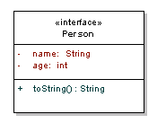
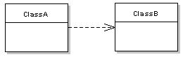
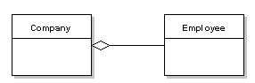
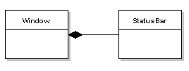
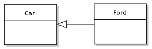
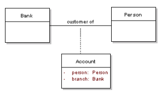

## Uniform Model Langauge (UML)

The Unified Modeling Language ([UML](http://uml.org/)) is a general-purpose, developmental, modeling language in the field of software engineering, that is intended to provide a standard way to visualize the design of a system.

In this course we'll model Entities and their Relationships using UML Class Diagrams.

## Class Diagrams
Class diagrams describe the static structure of the classes in your system and illustrate attributes, operations and relationships between the classes.

### Modeling Classes

The representation of a class has three compartments.

Figure 1: Class representation

From top to bottom this includes:

* Name which contains the class name as well as the stereotype, which provides information about this class. Examples of stereotypes include <<interface>>, <<abstract>> or <<controller>>.  
* Attributes lists the class attributes in the format name:type, with the possibility to provide initial values using the format name:type=value.  
* Operations lists the methods for the class in the format method( parameters):return type.  
* Operations and attributes can have their visibility annotated as follows: + public, # protected, - private, ~ package

### Relationship Description
#### Dependency 
Dependency *"uses a"*, is a weak, usually transient, relationship that illustrates that a class uses another class at some point.

Figure 2: ClassA has dependency on ClassB

#### Association 
Association, *"has a"*, is a stronger relationship than dependency, the solid line relationship indicates that the class retains a reference to another class over time.

Figure 3: ClassA associated with ClassB

#### Aggregation 
Aggregation, *"owns a"*, is more specific than association, this indicates that a class is a container or collection of other classes. The contained classes do not have a life cycle dependency on the container, so when the container is destroyed, the contents are not. This is depicted using a hollow diamond.

Figure 4: Company contains Employees

#### Composition 
Composition, *"is part of"* is a more specific than aggregation, this indicates a strong life cycle dependency between classes, so when the container is destroyed, so are the contents. This is depicted using a filled diamond.

  
Figure 5: StatusBar is part of a Window

#### Generalization
Generalization, *"is a"*. Also known as inheritance, this indicates that the subtype is a more specific type of the super type. This is depicted using a hollow triangle at the general side of the relationship.

  
Figure 6: Ford is a more specific type of Car

#### Association Classes

Sometimes more complex relationships exist between classes, where a third class contains the association information.

Figure 7: Account associates the Bank with a Person

Annotating relationships

For all the above relationships, direction and multiplicity can be expressed, as well as an annotation for the relationship. Direction is expressed using arrows, which may be bi-directional.

The following example shows a multiple association, between ClassA and ClassB, with an alias given to the link.

  

Figure 8: Annotating class relationships

*Notes or comments are used across all UML diagrams. They used to hold useful information for the diagram, such as explanations or code samples, and can be linked to entities in the diagram.*